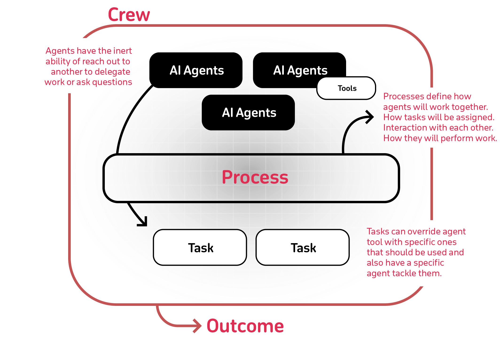

# Overview

A contract negotiation system that leverages various AI technologies to analyze, assist, and streamline the contract negotiation process.

[Website](https://contract-neg-system.streamlit.app/)


## Table of Contents
*generated with [DocToc](https://github.com/thlorenz/doctoc)*

- [Overview](#overview)
  - [Table of Contents](#table-of-contents)
  - [Overview](#overview-1)
  - [Key Features](#key-features)
  - [Technologies Used](#technologies-used)
  - [Project Structure](#project-structure)
  - [Setup](#setup)
  - [Usage](#usage)
  - [Mindmap](#mindmap)
  - [Development](#development)
    - [Package Management with uv](#package-management-with-uv)
    - [Pre-commit Hooks](#pre-commit-hooks)
    - [Customizing AI Agents](#customizing-ai-agents)
    - [Modifying RAG Functionality](#modifying-rag-functionality)
  - [Troubleshooting](#troubleshooting)


## Overview

Automate the contract review process through the following steps:

1. **Document Parsing**:
   - Uploads a contract document (PDF or DOCX) to the system.
   - Uses Upstage's document parser API to convert the contract into plain text.

2. **Clause Segmentation**:
   - Employs Llama 3.1 (running on Together AI) to split the contract text into individual clauses.
   - Structures the clauses in JSON format for further processing.

3. **AI-Powered Clause Analysis**:
   - For each clause, triggers an AI agent orchestrated through Crew AI.
   - Within each agent, the clause text is passed to the RAGTool function in Composio, which is integrated with Crew AI.
   - This RAG system queries a Chroma DB that has been pre-trained on a repository of existing contract clauses.
   - Utilizes ChatGPT-4 to generate an analysis of each clause and recommendations for potential improvements, comparing with standard clauses in the Chroma DB.

4. **User Interaction**:
   - Presents the analysis and recommendations to the user through a Streamlit interface.
   - Allows the user to choose whether to accept or reject each clause or add points for negotiation.

5. **Response Generation**:
   - Collects all user feedback, including analysis and recommendations for each clause.
   - Passes this information back to Llama 3.1 on Together AI.
   - Generates a draft response to the original contract drafter, suggesting amendments based on the analysis and user input.

## Key Features

- Automated contract parsing using Upstage's document parser API
- AI-driven clause segmentation using Llama 3.1 on Together AI
- Detailed clause analysis using Crew AI, Composio's RAGTool, and ChatGPT-4
- Comparison with standard clauses stored in Chroma DB
- User-friendly interface for reviewing and providing input on each clause
- Automated generation of response drafts for contract amendments using Llama 3.1

## Technologies Used
[data-doc-management]

   - Upstage: Converts natural language queries into SQL. In this project use Document Parser API to convert contracts to text format [Doc](https://console.upstage.ai/docs/getting-started/overview)
   - Chroma DB: Vector database for storing and querying standard contract clauses
   - SQLite: Database for storing application data


[ai-model-curation]

   - OpenAI GPT-4: Advanced language model for clause analysis and recommendations
   - Together AI: Hosting Llama 3.1 for text processing, clause segmentation, and response generation
   - AIML API: Curation platform to access AI models and other tasks
   - LiteLLM: Curation platform to choose lite LLMs as per objectives [Doc: Model Providers](https://docs.litellm.ai/docs/providers)


[task-handling]

   - Crew AI: An open-source Python framework designed to support developing and managing multi-agent AI systems
      - [Crew AI framework](https://docs.composio.dev/framework/crewai)

   - Composio: Coonect RAG agents with external tools, Apps, and APIs to perform actions and receive triggers
      - [Doc](https://composio.dev/)
      - [Composio Toolset: RagTool](https://app.composio.dev/app/ragtool)
      - [Composio Tool for Crew AI](https://docs.crewai.com/tools/composiotool)


[deployment-framework]

   - Python: Primary programming language
   - Flask: Web framework for the backend API
   - Streamlit: Frontend user interface
   - uv: Fast Python package installer and resolver
   - pre-commit: Managing and maintaining pre-commit hooks


## Project Structure

```
.
├── __init__.py
├── app.py                 # Flask application
├── clause_agents.py       # Definitions for AI agents
├── clause_tasks.py        # Task definitions for AI agents
├── crew.py                # Crew AI orchestration
├── db/                    # Database files
│   ├── chroma.sqlite3
│   └── ...
├── models.py              # Data models
├── streamlit_app.py       # Streamlit frontend
├── tools.py               # Utility functions and tools
└── uploads/               # Uploaded contract files
```

## Setup

1. Install the `uv` package manager:
   ```
   pip install uv
   ```

2. Install dependencies:
   ```
   uv venv --python=python3.12
   source .venv/bin/activate

   uv pip install -r requirements.txt -v
   ```

3. Set up environment variables:
   Create a `.env` file in the project root and add the following:
   ```
   TOGETHER_API_KEY=your_together_api_key
   UPSTAGE_API_KEY=your_upstage_api_key
   OPENAI_API_KEY=your_openai_api_key
   OPENAI_API_BASE=your_openai_api_base
   OPENAI_MODEL_NAME=your_openai_model_name
   ```

## Usage

1. Start the Flask backend:
   ```
   uv run python src/components/app.py
   ```
   The backend will be available at `http://localhost:5002`.

2. In a separate terminal, start the Streamlit frontend:
   ```
   uv run streamlit run src/components/streamlit_app.py
   ```
   Access the frontend at `http://localhost:8503` in your web browser.

3. Upload a contract document through the Streamlit interface.

4. The system will process the document, segment it into clauses, and provide analysis and recommendations for each clause.

5. Review the analysis, accept or reject recommendations, and add negotiation points as needed.

6. Generate a response to the contract drafter based on your inputs.


## Mindmap



## Development

### Package Management with uv

- Add a package: `uv add <package>`
- Remove a package: `uv remove <package>`
- Run a command in the virtual environment: `uv run <command>`

### Pre-commit Hooks

1. Install pre-commit hooks:
   ```
   uv run pre-commit install
   ```

2. Run pre-commit checks manually:
   ```
   uv run pre-commit run --all-files
   ```

Pre-commit hooks help maintain code quality by running checks for formatting, linting, and other issues before each commit.

*To skip pre-commit hooks
   ```
   git commit --no-verify -m "your-commit-message"
   ```

### Customizing AI Agents

To modify or add new AI agents, edit the `clause_agents.py` file. Each agent is defined with a specific role, goal, and set of tools.

### Modifying RAG Functionality

The RAG system uses Chroma DB to store and query contract clauses. To update the knowledge base:

1. Add new contract documents to the `uploads/` directory.
2. Modify the `tools.py` file to update the ingestion process if necessary.
3. Run the ingestion process to update the Chroma DB.


## Troubleshooting

Common issues and solutions:
- API key errors: Ensure all API keys in the `.env` file are correct and up to date. (See `.env.init`)
- Database connection issues: Check if the Chroma DB is properly initialized and accessible.
- Memory errors: If processing large contracts, you may need to increase the available memory for the Python process.
- Issues related to the AI agents or RAG system: Check the `output.log` file for detailed error messages and stack traces.
